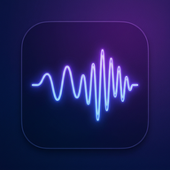

# Android Pitch Scaler

A sleek, native Android application that captures system audio in real-time, applies pitch-shifting (scaling) via SoundTouch (C++ NDK), and routes the audio back to the user seamlessly. It's built with Jetpack Compose for a modern UI.

## Features
- **Real-Time System Audio Capture:** Uses the Android 10+ `AudioPlaybackCapture` API to record audio playing from other apps (e.g., Spotify, YouTube).
- **High-Performance Pitch Shifting:** Powered by the native [SoundTouch](https://codeberg.org/soundtouch/soundtouch) C++ library running directly in a DSP thread via JNI, ensuring low latency and high quality compared to pure-Kotlin implementations.
- **Dynamic Audio Routing:** Automatically detects headphone connectivity and routes the shifted audio optimally:
  - Headphones connected: Uses the `Accessibility` stream.
  - No headphones: Uses the `Alarm` stream.
- **MediaSession Volume Interception:** Hijacks the physical hardware volume buttons globally when active, allowing you to seamlessly control the pitch-shifted audio volume without accidentally unmuting the original background app.

## Important Limitations

Due to Android's strict audio sandboxing and security model, this application cannot natively drop or mute the source application's playback passively. To avoid hearing a terrible echo (the original song playing over the pitch-shifted song), this app implements a hybrid routing strategy:
1. It records the `Media` stream.
2. It scales the captured audio and plays it over either the `Alarm` stream or the `Accessibility` stream (depending on if headphones are connected).
3. It aggressively sets the system's `Media` stream volume to `0` to mute the original app.

If the volume automation fails on your specific Android skin, **you must manually mute your phone's Media stream to properly listen to the shifted audio on the Alarm/Accessibility stream.**

## Build Instructions

### Prerequisites
- Android Studio Ladybug or newer.
- Android NDK (Side by side) installed via SDK Manager.
- CMake installed via SDK Manager.
- An Android 10+ physical device or emulator (API 29+).

### Building and Running
1. Clone this repository.
2. Open the project in Android Studio.
3. Gradle will automatically sync and build the CMake/C++ SoundTouch library.
4. Click **Run** on your target device.

> **Note:** Apps like Spotify allow their audio to be captured by default. However, some apps (like Netflix or banking apps) explicitly forbid screen/audio recording via the `FLAG_SECURE` layout flag. Pitch Scaler cannot record audio from those apps.

## Architecture & Technical Stack
- **Kotlin & Jetpack Compose:** For the UI, Foreground Services, and Android API interfacing.
- **C++ (NDK/JNI):** For the heavy lifting DSP algorithms to ensure the app doesn't suffer from JVM garbage collection stuttering.
- **CMake:** For cross-compiling the SoundTouch library.
